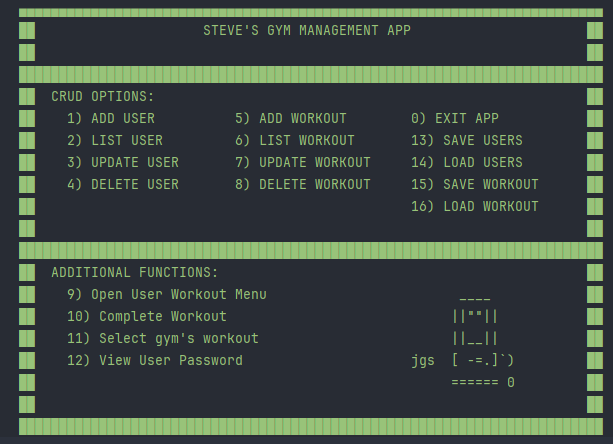

# **STEVE'S GYM MANAGEMENT APP README**

## **Introduction 👋**

Welcome to Steve's Gym Management App, a vibrant and dynamic Kotlin-based application designed to bring ease and efficiency to gym management. This comprehensive solution, crafted with passion and precision, is the perfect companion for gym owners and fitness enthusiasts alike, offering a seamless integration of user and workout management.

## Key Features 🫠

### **User-Friendly Interface**

The app boasts an aesthetically pleasing and interactive ASCII art-based main menu, making navigation both engaging and intuitive.

### **User Management**

Add Users: Effortlessly onboard new gym members with just a few clicks.
List Users: View a neatly organized list of all members, ensuring easy tracking and management.
Update Users: Modify user details swiftly, adapting to changes in user information.
Delete Users: Remove users from the system with ease, maintaining an up-to-date member list.

### Workout Management

Add Workouts: Tailor workout plans to meet individual needs, enhancing the training experience.
List Workouts: Access a detailed overview of all available workout sessions.
Update Workouts: Adjust workout details to keep up with evolving fitness regimes.
Delete Workouts: Remove outdated or unused workout plans, keeping the system efficient and relevant.

### Enhanced Functionality

Workout Completion Logging: You are able to track a users progress by logging completed workouts.
Archived Workouts: You can view the history of completed sessions, providing valuable insights into member activity.
User Workout Menu: A specialized menu for individual user workout preferences and tracking.
Rate Workouts: Members can rate their workouts.

### Security

Users are provided with a very secure password when added to the app

### Getting Started ❤️

Running the app is easy! Simply execute the main function, and you'll be greeted with the vibrant main menu. Navigate through the options to manage users and workouts, and watch as the app transforms your gym management experience.

